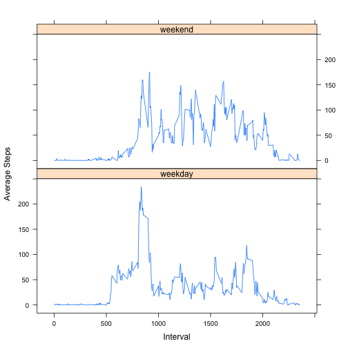

## Loading and preprocessing the data

```r
library(dplyr);

unzip("activity.zip");
activity <- tbl_df(read.csv("activity.csv", stringsAsFactors = FALSE));
file.remove("activity.csv");
```

```
## [1] TRUE
```


## What is mean total number of steps taken per day?

```r
getAllDates <- function(x) {
	unique(select(x, date));
}

getTotalSteps <- function(x) {
	stepsPerDay <- data.frame();
	for(day in x$date) {
		stepsPerDay <- rbind(stepsPerDay, summarize(filter(activity, date == day, !is.na(steps)), sum(steps)));
	}
	colnames(stepsPerDay) <- "total_steps";

	stepsPerDay;
}

getMean <- function(stepsPerDay) {
	sapply(stepsPerDay, mean, na.rm = TRUE);
}
getMedian <- function(stepsPerDay){
	sapply(stepsPerDay, median, na.rm = TRUE)
}

stepsPerDay <- getTotalSteps(getAllDates(activity));

hist(stepsPerDay$total_steps, xlab = "Total Steps", main = "Daily Step Frequency");
```

 

```r
print(getMean(stepsPerDay));
```

```
## total_steps 
##     9354.23
```

```r
print(getMedian(stepsPerDay));
```

```
## total_steps 
##       10395
```


## What is the average daily activity pattern?

```r
getAllIntervals <- function(x) {
	unique(select(x, interval));
}

getIntervalSteps <- function(x, dates) {
	stepsPerInterval <- data.frame();
	for(day in dates$interval) {
		stepsPerInterval <- rbind(stepsPerInterval, summarize(filter(x, interval == day, !is.na(steps)), mean(steps)));
	}
	colnames(stepsPerInterval) <- "intervalMean";

	stepsPerInterval;
}

createIntervalSteps <- function(x) {
	times <- getAllIntervals(x);
	timesSteps <- cbind(times$interval, getIntervalSteps(x, times));
	colnames(timesSteps) <- c("interval", "intervalMean");
	timesSteps;
}

avgStepsbyInterval <- createIntervalSteps(activity);
plot(avgStepsbyInterval$interval, avgStepsbyInterval$intervalMean, type = "l", xlab = "Interval", ylab = "Mean Steps");
```

 

```r
maxInterval <- filter(avgStepsbyInterval, intervalMean == max(intervalMean));
print(maxInterval$interval);
```

```
## [1] 835
```


## Imputing missing values

```r
getRowNum <- function(x) {
	mutate(x, rownum = row(x[,"steps"]))
}
findNAs <- function(x) {
	mutate(x, empty = is.na(x$steps));
}

# This function looks searches for the first previous non-NA value
# and the next non-NA value, and takes the average of those two values
# NOTE: because all NA values are surrounded by zeroes in this sample,
# the end result is zeroes in place of NAs
getAverage <- function(rowNumber, x) {
	getEarlier <- function(rowNumber) {
		currentDate <- x[rowNumber, "date"];
		# If first row, return average for the day
		if(rowNumber == 1) {
			value <- getMean(select(x, date == x[rowNumber, "date"]));
			as.numeric(value$steps);
		} else if(is.na(x[rowNumber - 1, "steps"])) {
			getEarlier(rowNumber - 1);
		} else {
			value <- x[rowNumber - 1, "steps"];
			as.numeric(value$steps);
		}
	}

	getLater <- function(rowNumber) {
		currentDate <- x[rowNumber, "date"];
		# If last row, return average for the day
		if(rowNumber == nrow(x)){
			value <- getMean(select(x, date == x[rowNumber, "date"]));
			as.numeric(value$steps);
		} else if(is.na(x[rowNumber + 1, "steps"])) {
			getLater(rowNumber + 1);
		} else {
			value <- x[rowNumber + 1, "steps"];
			as.numeric(value$steps);
		}
	}
	
	mean(c(getEarlier(rowNumber), getLater(rowNumber)));
}

estimateNAs <- function(x) {
	for(rowNumber in x$rownum) {
		if(x[rowNumber, "empty"] == TRUE) {
			x[rowNumber, "steps"] <- getAverage(rowNumber, x);
		}
	}
	x;
}

processedActivity <- findNAs(getRowNum(activity));
print(sum(processedActivity$empty));
```

```
## [1] 2304
```

```r
processedActivity <- estimateNAs(processedActivity);
processedActivity <- select(processedActivity, -empty, -rownum);
processedSteps <- getTotalSteps(processedActivity);

hist(processedSteps$total_steps, xlab = "Total Steps", main = "Daily Step Frequency (Averaging Missing Data)");
```

 

```r
print(getMean(processedSteps));
```

```
## total_steps 
##     9354.23
```

```r
print(getMedian(processedSteps));
```

```
## total_steps 
##       10395
```

## Are there differences in activity patterns between weekdays and weekends?

```r
findWeekends <- function(days) {
	final <- vector();
	for(day in days) {
		dayOfWeek <- as.character(weekdays(as.Date(day, "%Y-%m-%d")));
		if(dayOfWeek == "Saturday" | dayOfWeek == "Sunday") {
			final <- c(final, "weekend");
		} else {
			final <- c(final, "weekday");
		}
	}
	final;
}

mergeWeeks <- function(x, y) {
	x <- cbind(x, "weekday");
	y <- cbind(y, "weekend");

	colnames(x) <- c("interval", "intervalMean", "weekdayend");
	colnames(y) <- c("interval", "intervalMean", "weekdayend");

	rbind(x,y);
}

activityNew <- mutate(activity, weekdayend = findWeekends(date));

weekdaySteps <- createIntervalSteps(filter(activityNew, weekdayend == "weekday"));
weekendSteps <- createIntervalSteps(filter(activityNew, weekdayend == "weekend"));

mergedWeeks <- mergeWeeks(weekdaySteps, weekendSteps);

library(lattice)
xyplot(intervalMean ~ interval | weekdayend, mergedWeeks, layout = c(1,2), type="l", xlab = "Interval", ylab = "Average Steps")
```

 
